# STI-Project2

**Groupe: Guillaume Schranz & Michaël da Silva**

### Installation:

Pour installer notre système de messagerie, il suffit de lancer le script `run_server.sh`. Celui-ci va installer via docker notre projet et vous n'avez plus qu'à vous connectez sur `http://localhost:8080/`.

Vous pouvez vous connecter avec les utilisateurs suivants:

| Utilisateur | Mot de passe | Role           |
| ----------- | ------------ | -------------- |
| admin       | admin        | Administrateur |
| STIproject  | sti          | Collaborateur  |

### Application web:

##### Fonctionnalités pour Collaborateur et Administrateurs

L'application web est disponible à l'adresse suivante: `http://localhost:8080/`. 

Voici la page principal de l'application web.

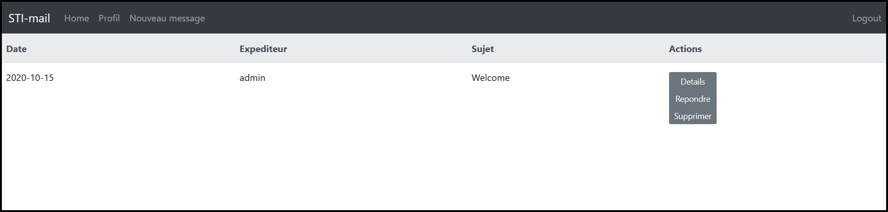

Sous "**Profil**", on peut obtenir les informations de notre compte et changer notre mot de passe.

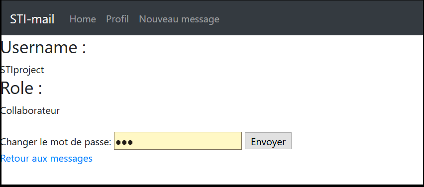

Pour le changement de mot de passe, il faut **obligatoirement** fournir un mot de passe contenant **une majuscule, une minuscule, un chiffre et un caractère spécial** (ex: P4$$w0rd).

Vous recevrez un message de confirmation si le changement de mot de passe a eu lieu.

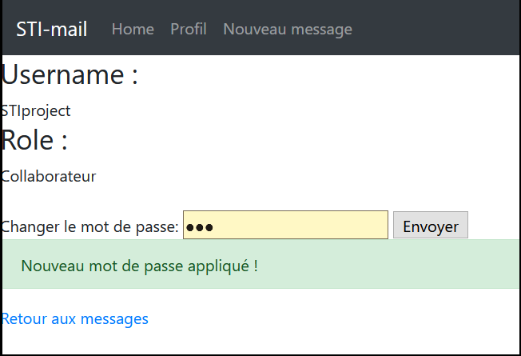

Sous "**Nouveau message**", vous pouvez envoyer un message à n'importe quel utilisateur de la messagerie.

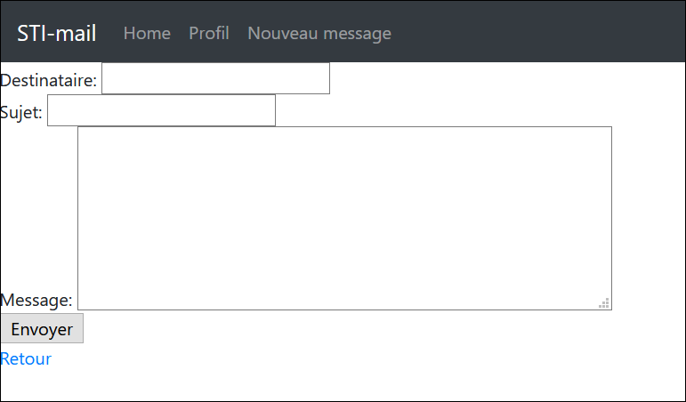

Attention: une **limite de 50 caractères pour le sujet** et de **1000 pour le corps du message** est mise en place. Vous recevez ici aussi un message de réussite lorsque l'email est envoyé (ou d'erreur s'il y en a une).

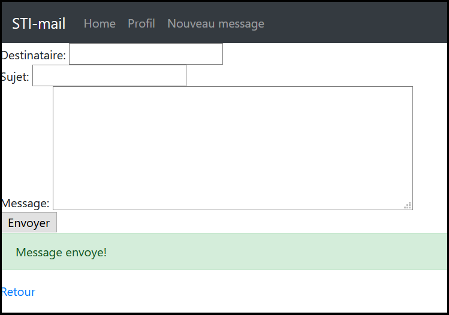

Les messages de votre boîte de messagerie peuvent être lu en cliquant sous "**Details**". Cela affiche l'email avec la date de réception, l'expéditeur, le sujet et le corps du message. Des boutons sont présents sur la droite afin de répondre directement à l'email ou le supprimer.

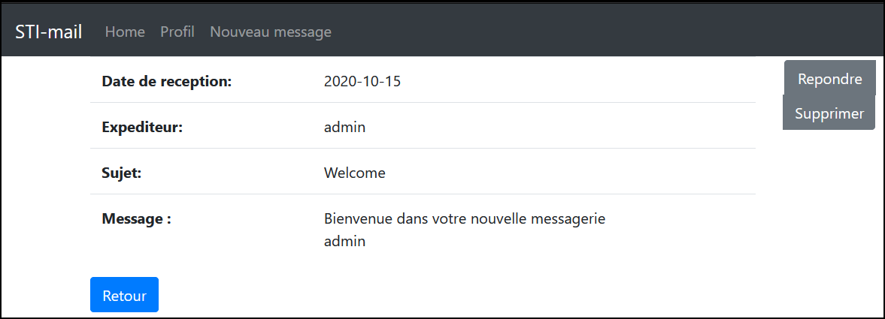

**Fonctionnalités pour Administrateurs**

L'Administrateur a accès à des fonctionnalités supplémentaires comparés aux Collaborateurs. D'ailleurs, leur page d'accueil est légèrement différente comparé aux Collaborateurs car elle contient un onglet "**Gestion d'utilisateurs**" qui va leur permettre de gérer les utilisateurs inscrits sur la messagerie.

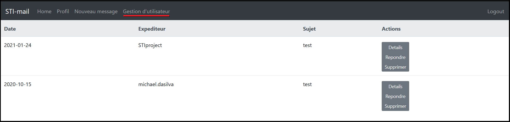

Ce gestionnaire d'utilisateurs permet à l'administrateur de supprimer, modifier ou ajouter un utilisateur.

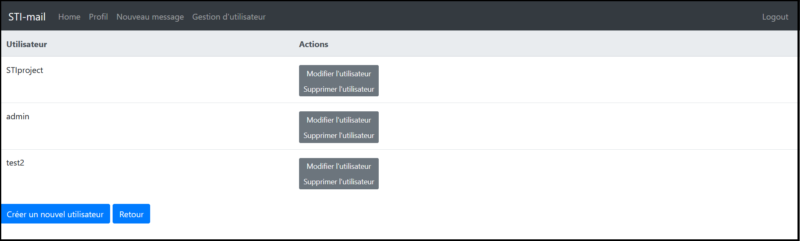

Lors de la création de l'utilisateur, l'application demande un nom d'utilisateur (qui doit être disponible dans la base de données), un mot de passe (selon la politique de mot de passe décrite précédemment), et sa validité ainsi que son rôle dans la messagerie.

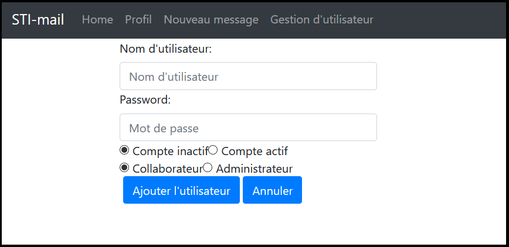

Si un nom d'utilisateur est déjà pris, ou qu'un mot de passe est trop faible, l'administrateur recevra un message d'erreur.

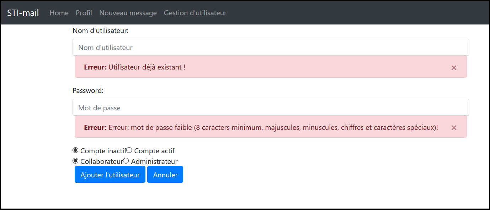

Sinon, l'utilisateur sera ajouté à la base de données et visible dans le gestionnaire d'utilisateurs.

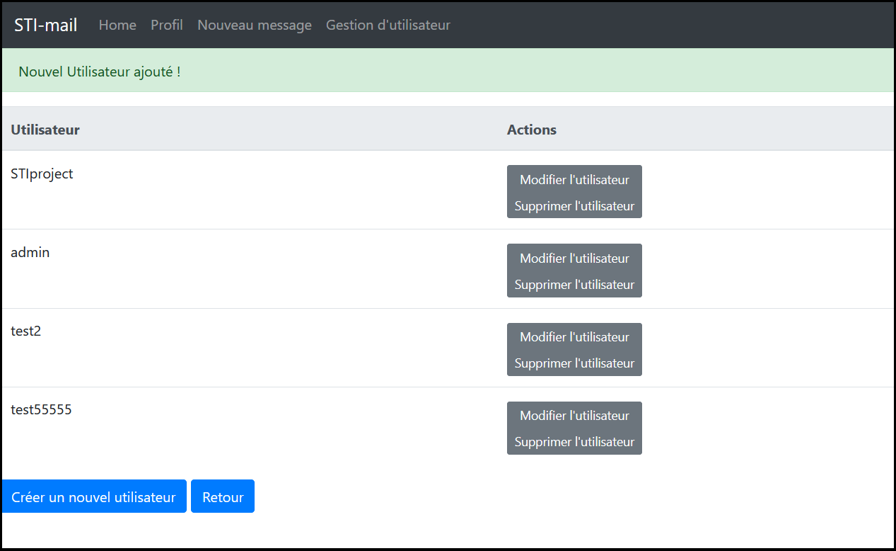

Enfin, la modification d'un utilisateur est très simple: on peut modifier son mot de passe, ou bien son rôle et sa validité afin d'activer son compte ou non sur l'application.

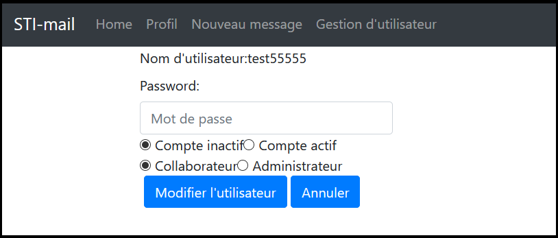

Les mêmes messages d'erreur sont appliqués ici concernant la modification du mot de passe.

Un compte désactivé ne peut se connecter à l'application.

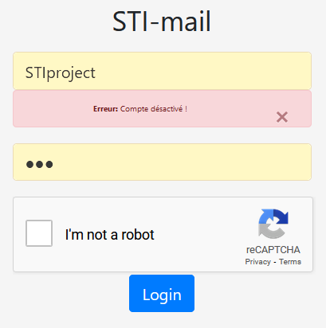

### **Base de données**

La base de données est accessible via l'adresse `http://localhost:8080/phpliteadmin.php`.

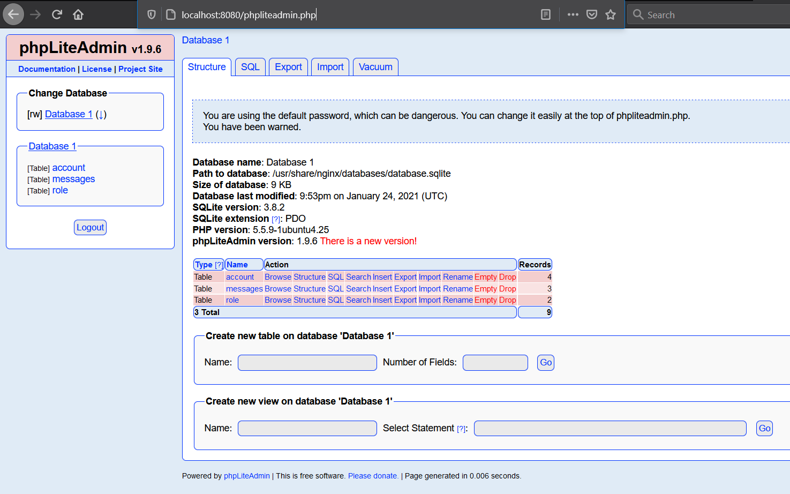

